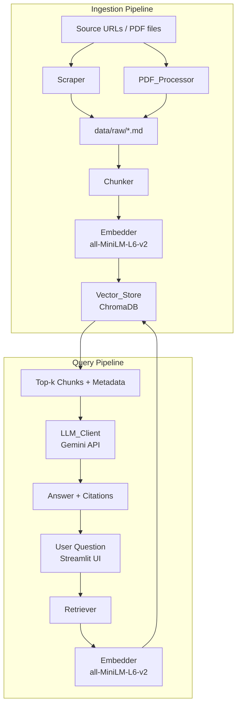

# Design Document: UMass HR RAG Chatbot

## Overview

The UMass HR RAG Chatbot is a Retrieval-Augmented Generation (RAG) system that enables HR staff and employees to ask natural-language questions and receive answers grounded in official UMass HR documentation. The system follows a two-phase architecture:

1. **Ingestion Phase** — Scrape web pages and process PDFs, chunk the resulting Markdown, embed chunks, and persist them in a local vector store.
2. **Query Phase** — Embed the user's question, retrieve the most semantically similar chunks, construct a prompt, call an LLM, and return a cited answer through a Streamlit UI.

The MVP uses a fully local, low-cost stack:
- **Web scraping**: `requests` + `trafilatura` (content extraction) + `markdownify` (HTML→Markdown)
- **PDF processing**: `pymupdf4llm` (PDF→Markdown with table/heading preservation)
- **Chunking**: token-aware sliding window with overlap
- **Embeddings**: `sentence-transformers` (`all-MiniLM-L6-v2`, 384-dimensional vectors)
- **Vector store**: ChromaDB (persistent local mode)
- **LLM**: Google Gemini API (`gemini-1.5-flash` default, configurable)
- **UI**: Streamlit

The design is intentionally layered so that each component (Scraper, PDF_Processor, Embedder, Vector_Store, Retriever, LLM_Client) can be swapped for a cloud equivalent (e.g., AWS Bedrock, OpenSearch, S3) without changing the orchestration logic.

---

## Architecture



### Key Design Decisions

- **Shared Embedder**: The same `all-MiniLM-L6-v2` model is used for both ingestion and query embedding. This is critical — using different models would break semantic similarity.
- **Deterministic filenames**: Raw Markdown files are named by a URL-safe hash of the source URL/filename, enabling idempotent re-ingestion.
- **Upsert semantics**: ChromaDB documents are upserted by a composite ID (`{source_hash}_{chunk_index}`), so re-running ingestion updates existing records rather than duplicating them.
- **Config-driven**: All tunable parameters live in `.env` / environment variables; no code changes are needed to switch LLM providers or adjust chunk size.

---

## Components and Interfaces

### Scraper

**Responsibility**: Fetch HTML from configured URLs and convert to clean Markdown.

```python
class Scraper:
    def fetch_and_convert(self, url: str) -> tuple[str, dict]:
        """
        Returns (markdown_text, metadata) where metadata contains:
          - source_url: str
          - document_title: str
        Raises ScraperError on unrecoverable failure.
        Logs and returns None on HTTP 4xx/5xx.
        """

    def save(self, markdown: str, metadata: dict) -> Path:
        """Writes markdown to data/raw/<url_hash>.md and saves metadata sidecar."""
```

**Libraries**: `requests` for HTTP, `trafilatura` for main-content extraction (strips nav/headers/footers), `markdownify` as fallback HTML→Markdown converter.

---

### PDF_Processor

**Responsibility**: Extract text, headings, and tables from PDF files and convert to semantic Markdown.

```python
class PDFProcessor:
    def process(self, pdf_path: Path) -> tuple[str, dict]:
        """
        Returns (markdown_text, metadata) where metadata contains:
          - source_filename: str
          - page_range: str  (e.g. "1-12")
        Raises PDFProcessorError on unrecoverable failure.
        Logs and returns None on corrupt/unreadable files.
        """

    def save(self, markdown: str, metadata: dict) -> Path:
        """Writes markdown to data/raw/<pdf_stem>.md and saves metadata sidecar."""
```

**Library**: `pymupdf4llm` — converts PDF pages to GitHub-compatible Markdown, preserving heading hierarchy and table structure.

---

### Chunker

**Responsibility**: Split a Markdown document into overlapping token-aware chunks.

```python
class Chunker:
    def __init__(self, chunk_size: int = 700, overlap_pct: float = 0.12):
        ...

    def chunk(self, text: str, metadata: dict) -> list[Chunk]:
        """
        Splits text into Chunk objects. Each Chunk contains:
          - text: str
          - metadata: ChunkMetadata
          - chunk_index: int
        Guarantees full coverage (union of all chunk texts == original text).
        """
```

**Token counting**: Uses `tiktoken` (cl100k_base encoding) for accurate token counts. Overlap is computed as `floor(chunk_size * overlap_pct)` tokens.

---

### Embedder

**Responsibility**: Convert text to 384-dimensional vectors using `all-MiniLM-L6-v2`.

```python
class Embedder:
    def __init__(self, model_name: str = "all-MiniLM-L6-v2"):
        self._model = SentenceTransformer(model_name)

    def embed(self, text: str) -> list[float]:
        """Returns a 384-dimensional embedding vector."""

    def embed_batch(self, texts: list[str]) -> list[list[float]]:
        """Batch embedding for efficiency during ingestion."""
```

The same `Embedder` instance is used by both the ingestion pipeline and the Retriever to guarantee embedding space consistency.

---

### Vector_Store

**Responsibility**: Persist chunks, embeddings, and metadata; support similarity search.

```python
class VectorStore:
    def __init__(self, persist_directory: str = "data/chroma"):
        self._client = chromadb.PersistentClient(path=persist_directory)
        self._collection = self._client.get_or_create_collection(
            name="hr_docs",
            metadata={"hnsw:space": "cosine"}
        )

    def upsert(self, chunks: list[Chunk], embeddings: list[list[float]]) -> None:
        """Upserts chunks by composite ID. Updates existing records."""

    def query(self, query_embedding: list[float], k: int = 5) -> list[RetrievedChunk]:
        """Returns top-k chunks ranked by cosine similarity."""

    def count(self) -> int:
        """Returns total number of stored chunks."""
```

ChromaDB's `PersistentClient` writes to disk automatically; data survives process restarts without explicit flush calls.

---

### Retriever

**Responsibility**: Embed a user query and retrieve the top-k most relevant chunks.

```python
class Retriever:
    def __init__(self, embedder: Embedder, vector_store: VectorStore, k: int = 5):
        ...

    def retrieve(self, query: str) -> list[RetrievedChunk]:
        """
        Embeds query, queries vector store, returns up to k RetrievedChunk objects.
        Returns empty list if vector store is empty.
        """
```

---

### LLM_Client

**Responsibility**: Construct a grounded prompt and call the configured LLM.

```python
class LLMClient:
    def __init__(self, model: str, api_key: str):
        # Uses Google Gemini API via google-generativeai SDK
        ...

    def generate(self, query: str, context_chunks: list[RetrievedChunk]) -> LLMResponse:
        """
        Constructs prompt with query + chunk texts, calls LLM, returns:
          - answer: str
          - citations: list[Citation]
        Raises LLMError on API failure.
        """
```

**Prompt template**:
```
You are a helpful UMass HR assistant. Answer the question using ONLY the provided context.
If the context does not contain enough information, say so clearly.
Always cite your sources.

Context:
{chunk_1_text} [Source: {source_1}]
...

Question: {query}

Answer:
```

---

### Ingestion Pipeline

**Responsibility**: Orchestrate the full scrape → process → chunk → embed → store pipeline.

```python
class IngestionPipeline:
    def run(self) -> IngestionSummary:
        """
        Executes: scrape URLs → process PDFs → chunk all docs → embed → upsert.
        Logs per-document failures and continues.
        Returns summary with counts of documents processed and chunks stored.
        """
```

Entry point: `python ingestion/ingest.py`

---

### UI (Streamlit)

**Responsibility**: Provide a web interface for submitting questions and displaying answers with citations.

- Text input for HR question
- Loading spinner during retrieval + generation
- Answer display with inline source citations
- Session-state conversation history
- Error display (user-friendly, no stack traces)

---

## Data Models

```python
from dataclasses import dataclass, field
from typing import Optional

@dataclass
class ChunkMetadata:
    source_url: Optional[str]       # For web-scraped content
    source_filename: Optional[str]  # For PDF content
    document_title: str
    chunk_index: int

@dataclass
class Chunk:
    text: str
    metadata: ChunkMetadata
    chunk_id: str  # "{source_hash}_{chunk_index}"

@dataclass
class RetrievedChunk:
    text: str
    metadata: ChunkMetadata
    similarity_score: float

@dataclass
class Citation:
    source: str   # URL or filename
    title: str

@dataclass
class LLMResponse:
    answer: str
    citations: list[Citation]

@dataclass
class IngestionSummary:
    documents_processed: int
    chunks_stored: int
    failures: list[str]  # List of failed source identifiers
```

### Storage Schema (ChromaDB Collection: `hr_docs`)

| Field | Type | Description |
|---|---|---|
| `id` | `str` | `"{source_hash}_{chunk_index}"` — unique, deterministic |
| `document` | `str` | Chunk text |
| `embedding` | `list[float]` | 384-dim vector from all-MiniLM-L6-v2 |
| `metadata.source_url` | `str \| None` | Original web URL |
| `metadata.source_filename` | `str \| None` | Original PDF filename |
| `metadata.document_title` | `str` | Document title |
| `metadata.chunk_index` | `int` | Position of chunk within source document |

### File Layout

```
project/
├── ingestion/
│   ├── ingest.py          # Entry point
│   ├── scraper.py
│   ├── pdf_processor.py
│   ├── chunker.py
│   ├── embedder.py
│   └── vector_store.py
├── retrieval/
│   ├── retriever.py
│   └── llm_client.py
├── ui/
│   └── app.py             # Streamlit app
├── data/
│   ├── raw/               # Scraped/processed Markdown files
│   └── chroma/            # ChromaDB persistent storage
├── config.py              # Reads .env / environment variables
├── models.py              # Shared dataclasses
├── .env.example
└── requirements.txt
```

---
